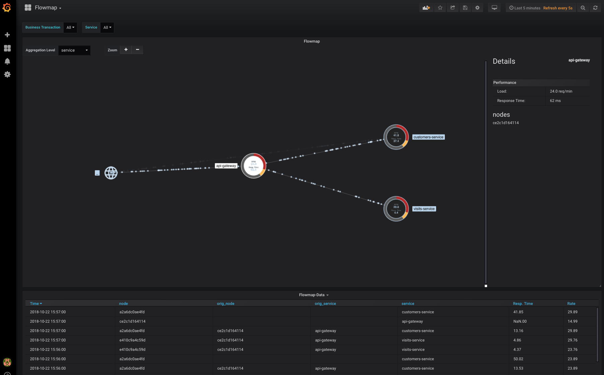

# OpenAPM Demo: OpenCensus, Jaeger, Prometheus, Grafana


## This Demo Includes
* Spring Pet-Clinic as microservice architecture (based on [spring-petclinic/spring-petclinic-microservices](https://github.com/spring-petclinic/spring-petclinic-microservices))
* Gatling load generator for the Pet-Clinic
* Basic instrumentation of the Pet-Clinic with OpenCensus
* Collecting traces with Jaeger through OpenCensus
* Collecting metrics with Prometheus through OpenCensus
* Grafana, including predefined dashboard showing
    * Metric-based, dynamic flow map


## Starting Demo
Execute the following command in the root directory of the project:
```
docker-compose up
```

Load generation starts with a delay of 5 minutes! (To ensure that all services are up and running properly.)


## Accessing Services
The services are accessible under the following addresses:
* Pet-Clinic: [http://localhost:8080](http://localhost:8080)
* Prometheus: [http://localhost:9090](http://localhost:9090)
* Jaeger: [http://localhost:16686](http://localhost:16686)
* Grafana: [http://localhost:3002](http://localhost:3002) (User: admin, Password: openapm)

## Grafana Screenshots

